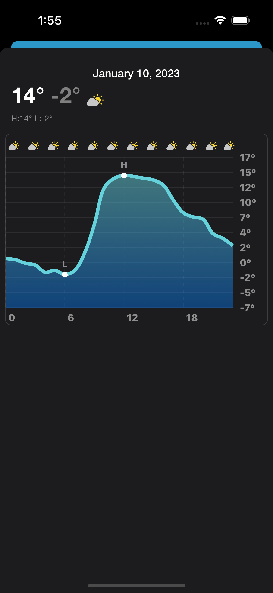

## Weather App

Simple Weather App prototype using an MVVM architecture. Weather reports are pulled through a `DataSource` interface from either OpenMeteo 
or OpenWeather, with new data sources being easy to integrate. Detailed weather charts are graphed using the new `ChartKit` announced in 
iOS 16.

